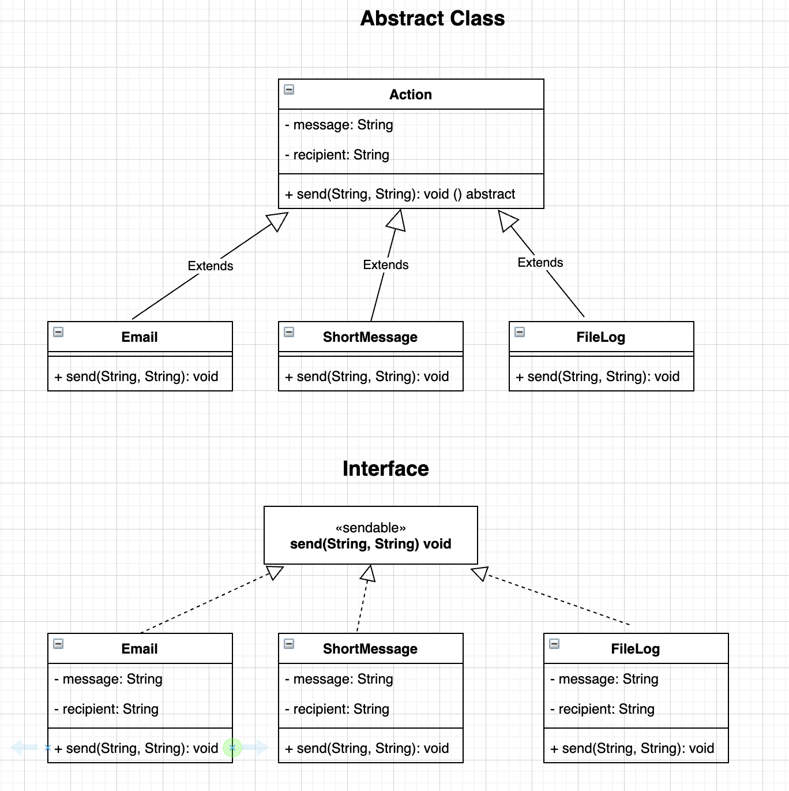

# Polymorphism & Composition Homework - Quiz
## Polymorphism

### 1. What does the word 'polymorphism' mean?

Answer： "Polymorphism" means One object can have many forms. 

### 2. What does it mean when we apply polymorphism to OO design? Give a simple Java example.

Answer: When we apply polymorphism to OO design, it means a single interface to entities of different types or the use of a 
single symbol to represent multiple different types.    

### 3. What can we use to implement polymorphism in Java?

Answer: In Java, we can use abstract class or interface to implement polymorphism. 

### 4. How many 'forms' can an object take when using polymorphism?

Answer: As many as need. 

### 5. Give an example of when you could use polymorphism.

Answer: As we discussed in 3, java allows us to use an abstract class or interface to implement polymorphism. The image below shows the example we could use polymorphism. Suppose we are designing a network management system. If an alert produced (for example, CPU temperature too high, device mount/unmount, user login/logout). We defined these alerts into different levels and trigger different actions. CPU temperature too high can be urgent, should send a short message via mobile phone to the administrator, device mount/unmount can be important but not very urgent, can send an email to the administrator, user login/logout can write to a log file. 

We can define an abstract class Action and an abstract method called send which has two arguments, one is the message and the other is who will receive this message. We can write the java code below:

```
//  If alert == device mount/unmount
Action action = new Email(String message, String recipient);
action.send(message, recipient)  
```

We can also define an Interface called sendable(in this interface, there has a method called send which has two arguments) and let the class Email, short message, and FileLog implement this interface. We can write the java code below:
```
//  If alert == CPU temperature too high
SendAble sendable = new ShortMessage(String message, String recipient);
sendable.send(message, recipient);
```




## Composition
### 1. What do we mean by 'composition' in reference to object-oriented programming?

Answer: Reference to OOP, 'composition' means an instance of a class can be a property of another class object. 

### 2. When would you use composition? Provide a simple example in Java.
Answer: If the property is complex and cannot be defined by a primary type like int, double. We should use composition. 
Composition property can be a user-defined class or java build in class like String, ArrayList. 

```
public class Battery{
  private int range;
}

public class Camera{
  private String typeOfLens;
}

public class MobilePhone{
  private Battery battery;
  private ArrayList<Camera> cameras;
}
```

### 3. What is/are the advantage(s) of using composition?
Answer: a. Make the code easy to understand and maintain.
        b. The main object of class has an instance of property class. Means, the property class can be 
        encapsulated and focused on the jobs it should do.         

### 4. When an object is destroyed, what happens to all the objects it is composed of?
Answer: All destroyed. 
